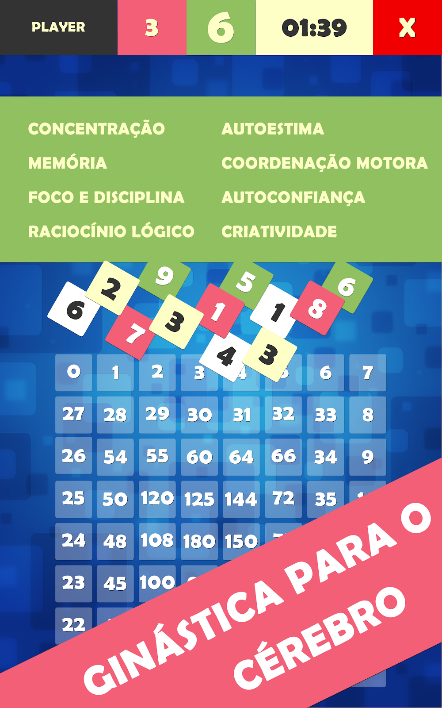
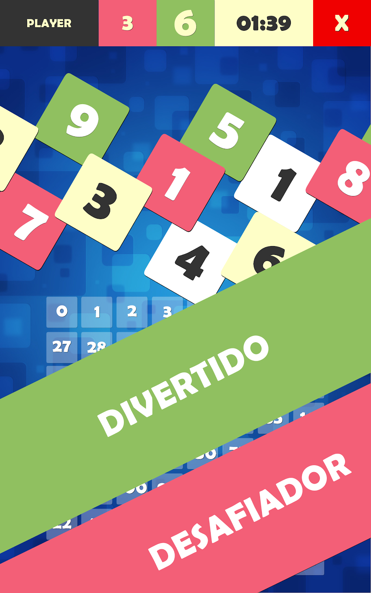
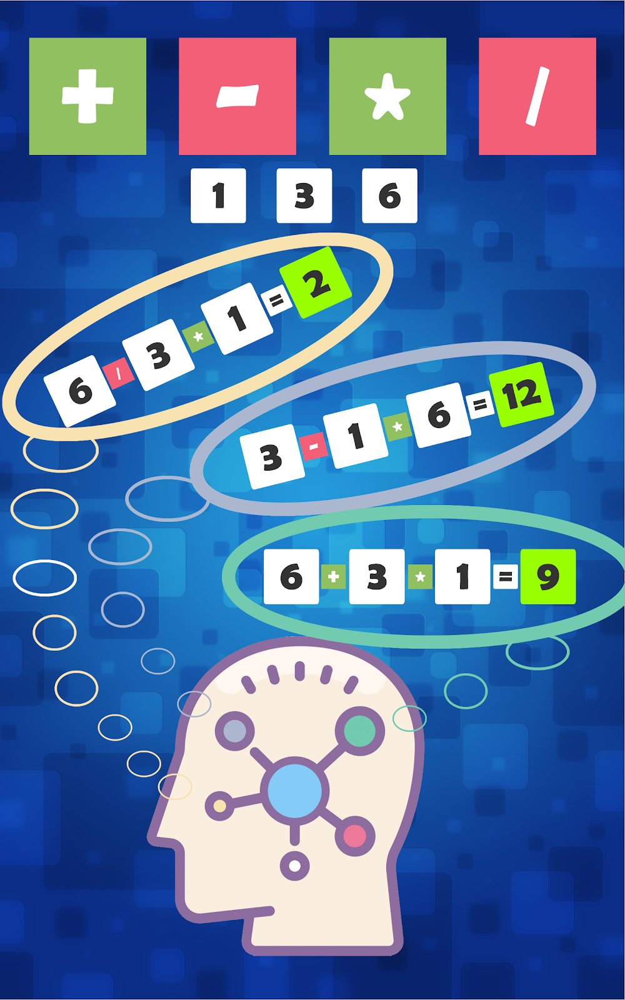
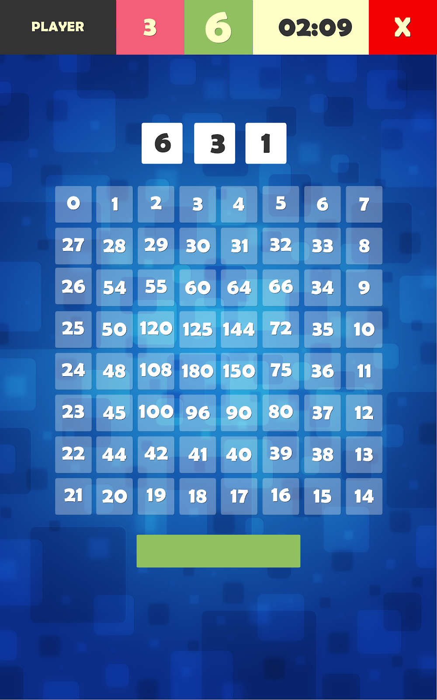
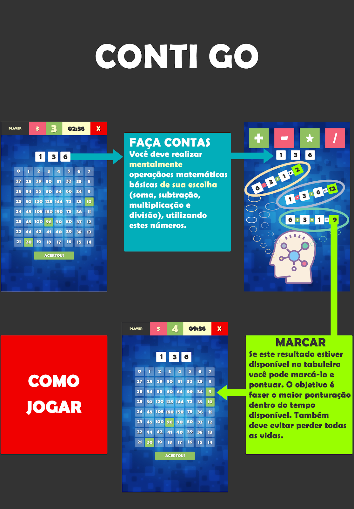

# Histórico de Desenvolvimento do Jogo

## Início do Projeto
O desenvolvimento do jogo começou em julho de 2019 durante o último semestre da especialização em Informática Aplicada à Educação no Instituto Federal de São Paulo (IFSP Câmpus Itapetininga). Na disciplina de Desenvolvimento de Jogos Digitais, o professor Wilton nos propôs criar um jogo educacional.

## Equipe
O time base era composto por:
- Michael Lourenço (eu - desenvolvedor)
- Sylvia Martins
- Letícia Montanari

Mais tarde, Taíse Keller e Odair Bazante se juntaram para colaborar com ideias e partes educacionais, áreas onde eu não tinha tanto conhecimento.

## Ideia Inicial
Durante o brainstorming, Letícia sugeriu transformar o jogo analógico [Conti 60](http://www.matematica.seed.pr.gov.br/modules/conteudo/conteudo.php?conteudo=52) em digital. Nossa adaptação principal foi fazer com que os jogadores disputassem as peças simultaneamente, evitando a espera de turnos, o que tornaria o jogo mais dinâmico. O público-alvo definido foi de crianças a partir de 8 anos, por já dominarem as operações matemáticas básicas (+, -, *, /).

## Desenvolvimento e Desafios
Alguns desafios enfrentados durante o desenvolvimento:
- **Testes**: Dificuldade em encontrar testadores.
- **Mecânica**: Problema no cálculo do resultado após selecionar uma peça.
- **Plataforma**: Inicialmente lançado para PC, mas tivemos problemas com a necessidade de jogar no mesmo teclado ou falta de joysticks. Decidimos criar uma versão mobile para um jogador, o que exigiu alterações nas regras para refletir a nova jogabilidade.


## Funcionalidades Adicionadas
- **Leaderboard**: Estudei a API do Google Play Services para implementar o placar online e offline, mantendo um ranking com os 10 melhores resultados.
- **Publicação**: O jogo foi publicado na Google Play Store em 04/03/2020, inicialmente com um ranking offline.

## Feedbacks e Melhorias
- **Versão Alfa**: Lançada em 09/03/2020.
- **Versão Beta**: Lançada em 10/03/2020. Após feedback da minha prima Sacha, identifiquei um bug que impedia a gravação do ranking quando o jogo acabava pelo tempo. Resolvi o problema no código do `GameController.cs`.

## Imagens 
Seguem imagens que mostram como jogar e objetivos da primeira versão jogo mobile (est e jogo não foi publicado, ficou na versão de testes).

<p align="center">
  
</p>
<p align="center">
  
</p>
<p align="center">
  
</p>
<p align="center">
  
</p>
<p align="center">
  
</p>
<p align="center">
  
</p>
<p align="center">
  
</p>
<p align="center">
  
</p>

# UPDAT ETO NEXT.JS VERSION
Changing simple HTML version to Next.js version

This is a [Next.js](https://nextjs.org) project bootstrapped with [`create-next-app`](https://nextjs.org/docs/app/api-reference/cli/create-next-app).

## Getting Started

First, run the development server:

```bash
npm run dev
# or
yarn dev
# or
pnpm dev
# or
bun dev
```

Open [http://localhost:3000](http://localhost:3000) with your browser to see the result.

You can start editing the page by modifying `app/page.tsx`. The page auto-updates as you edit the file.

This project uses [`next/font`](https://nextjs.org/docs/app/building-your-application/optimizing/fonts) to automatically optimize and load [Geist](https://vercel.com/font), a new font family for Vercel.

## Learn More

To learn more about Next.js, take a look at the following resources:

- [Next.js Documentation](https://nextjs.org/docs) - learn about Next.js features and API.
- [Learn Next.js](https://nextjs.org/learn) - an interactive Next.js tutorial.

You can check out [the Next.js GitHub repository](https://github.com/vercel/next.js) - your feedback and contributions are welcome!

## Deploy on Vercel

The easiest way to deploy your Next.js app is to use the [Vercel Platform](https://vercel.com/new?utm_medium=default-template&filter=next.js&utm_source=create-next-app&utm_campaign=create-next-app-readme) from the creators of Next.js.

Check out our [Next.js deployment documentation](https://nextjs.org/docs/app/building-your-application/deploying) for more details.
