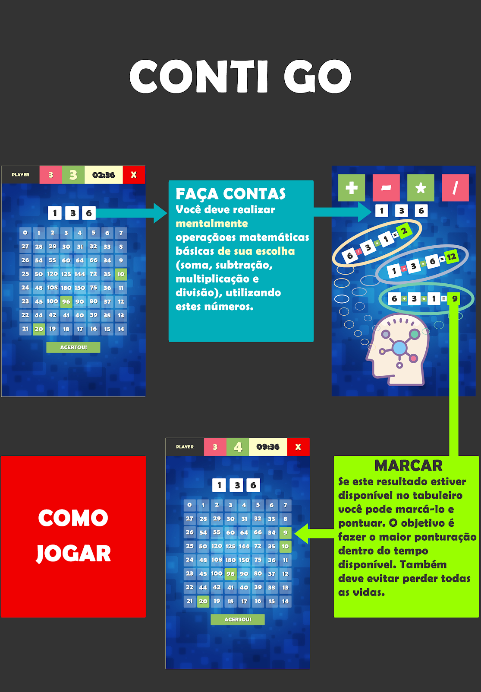
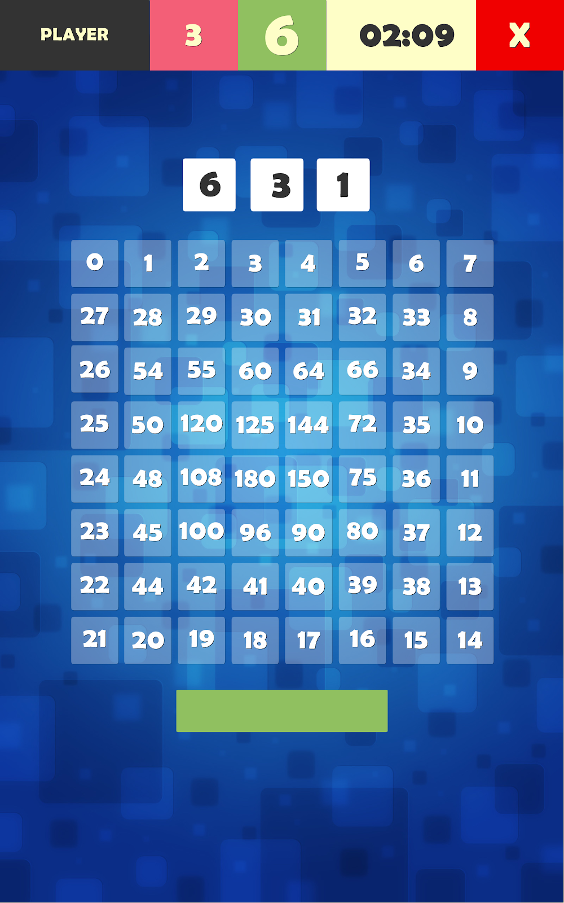
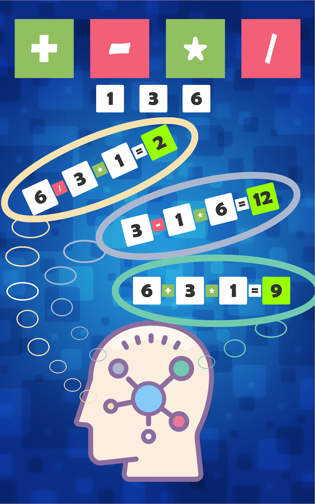
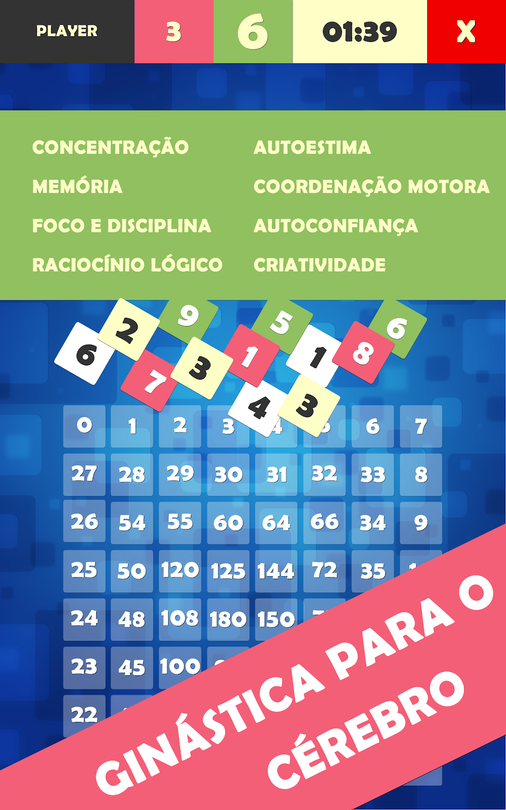
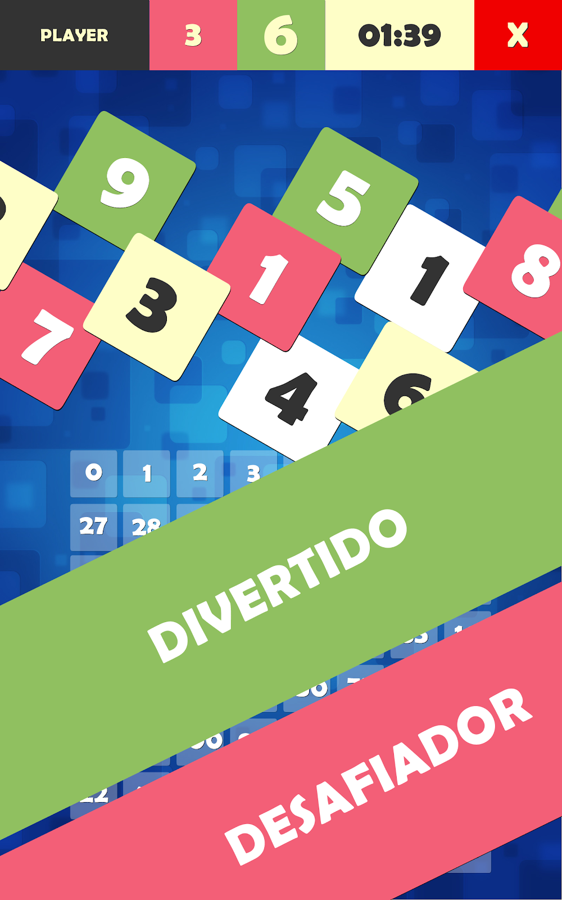
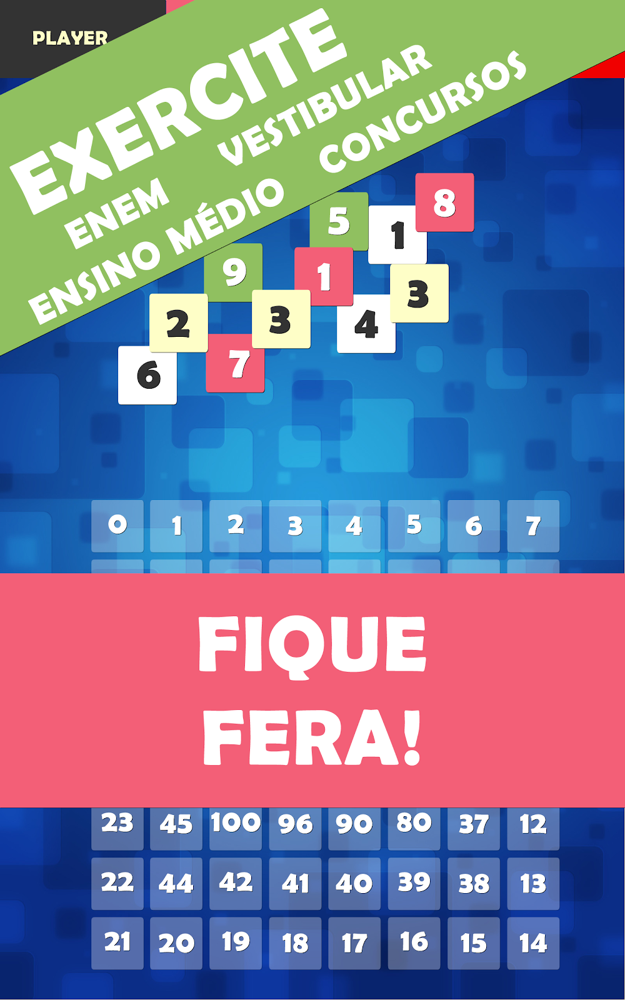
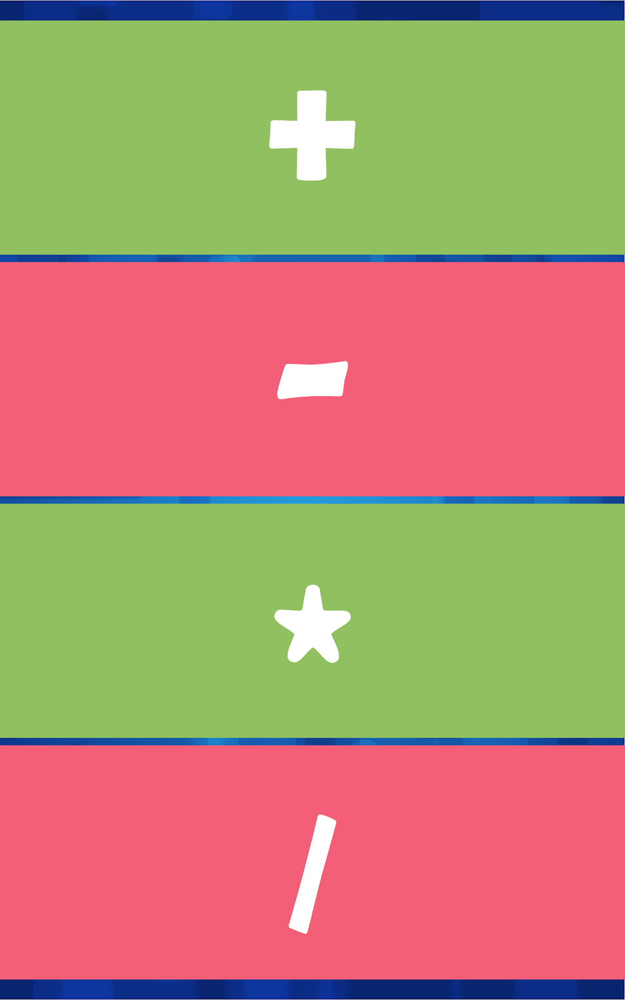
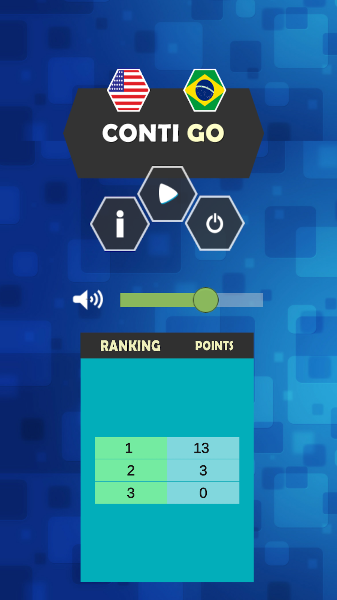

# CONTI GO 2023
➡️ <a href="https://contigo-wine.vercel.app/" target="_blank">Acesse a demonstração ao vivo</a>

  

## OBJETIVO
1. Passar a versão do CONTI GO mobile para a versão HTML/Javascript.
2. Desenvolver sistemas de coleta de dados para obter informações relevantes sobre diversos aspectos do jogo como: utilização/resultado/melhoria local, individual, regional, global.

## O QUE É O CONTI GO?
Conti GO é um jogo de tabuleiro envolvente e educativo que desafia os jogadores a usar suas habilidades matemáticas e pensamento estratégico. Situados em uma grade 8x8, os jogadores devem resolver quebra-cabeças matemáticos usando adição, subtração, multiplicação e divisão para marcar números no tabuleiro. O jogo apresenta uma corrida contra o tempo, com os jogadores competindo para alcançar a pontuação mais alta resolvendo problemas corretamente e marcando os números correspondentes no tabuleiro.

## COMO JOGAR

1. **Iniciar o Jogo:**  
   Abra o jogo no seu PC ou dispositivo Android e inicie uma nova sessão [clicando aqui](https://contigo-wine.vercel.app/):

2. **Receber Números:**  
   Você receberá 3 números aleatórios.

  

3. **Calcular:**  
   Use esses números para realizar uma operação matemática (soma, subtração, multiplicação ou divisão) para obter um resultado.

  

4. **Marcar o Tabuleiro:**  
   Encontre o resultado calculado no tabuleiro e marque-o, se ainda não tiver sido marcado.

5. **Pontos e Vidas:**  
   - **Correto:** Você ganha 1 ponto, e a casa é marcada.
   - **Incorreto:** Você perde 1 vida.

6. **Continuar Jogando:**  
   O jogo continua até você perder todas as vidas ou o tempo do jogo acabar.

7. **Ganhar ou Perder:**  
   Tente marcar o máximo de pontos possível antes do jogo terminar.

## POSSÍVEIS OBJETIVOS EDUCACIONAIS

- Cálculos, Lógica, Noções Espaciais e Agilidade.

### Habilidades Matemáticas

- Resolver e elaborar problemas com números naturais envolvendo adição e subtração, utilizando estratégias diversas, como cálculo, cálculo mental e algoritmos, além de fazer estimativas do resultado.
- Utilizar as relações entre adição e subtração, bem como entre multiplicação e divisão, para ampliar as estratégias de cálculo.
- Utilizar as propriedades das operações para desenvolver estratégias de cálculo.

### Habilidades Sociais

- Aprender a lidar com a vitória.
- Aprender a lidar com a derrota.
- Aprender a lidar com a ansiedade.
- Aprender a lidar com a pressão.
- Tomar decisões.
- Estratégia.
- Observar.

## REGRAS DO JOGO CONTI GO

**Gênero:** Jogo de Tabuleiro  
**Plataforma:** PC, ANDROID  
**Nº de Jogadores:** 1  
**Idade:** 8+

## COMPONENTES DO JOGO
- 1 tabuleiro 8x8, totalizando 64 casas.
- Cada casa é numerada de forma aleatória.
- 64 casas numeradas. Os números possíveis são:
  0, 1, 2, 3, 4, 5, 6, 7, 8, 9, 10, 11, 12, 13, 14, 15, 16, 17, 18, 19, 20, 21, 22, 23, 24, 25, 26, 27, 28, 29, 30, 31, 32, 33, 34, 35, 36, 37, 38, 39, 40, 41, 42, 44, 45, 48, 50, 54, 55, 60, 64, 66, 72, 75, 80, 90, 96, 100, 108, 120, 125, 144, 150, 180.
- Um contador de tempo principal do jogo.
- Conjunto de peças para cada jogador.
- 3 dados.
- 3 corações que representam as vidas do jogador.
- Um contador de tempo de jogo.

## COMPETIDORES
O jogador joga contra o tempo.

## REGRAS

- Existe um tempo principal do jogo.
- Quando o tempo principal do jogo acabar, o resultado por tempo é acionado.
- Em cada rodada do jogador, acontece a seguinte sequência:
  - O jogador recebe 3 números.
  - Com esses números, realizar mentalmente operações matemáticas de sua escolha, sendo elas: soma, subtração, multiplicação e divisão.
  - Após encontrar um resultado, o jogador deve marcá-lo no tabuleiro, caso o mesmo ainda não tenha sido marcado anteriormente.

### Se estiver correto:
- O jogador recebe 1 ponto.
- O jogador segue para a próxima rodada de jogador.
- A casa do tabuleiro fica marcada com a cor do jogador.
- A casa não pode mais ser selecionada pelo jogador.

### Se estiver incorreto:
- O jogador perde 1 (uma) vida.
- Segue para a próxima rodada de jogador.

- O jogador pode escolher pular a rodada, caso ache que com os números que têm atualmente não é possível encontrar um resultado no tabuleiro.

### Se estiver correto:
- O jogador não perde nem ganha pontos.
- Segue para a próxima rodada de jogador.

### Se estiver errado:
- O jogador perde uma vida.
- Segue para a próxima rodada de jogador.

## CONDIÇÕES DE FIM DE JOGO

- Se o jogador perder todas as vidas, o jogo acaba.
- Se o tempo principal do jogo acabar, o jogo acaba.

## DADOS DE PUBLICAÇÃO

### Breve descrição ou slogan
Mostrado quando vinculamos ao seu projeto. Evite duplicar o título do seu projeto

> Aprimore suas habilidades matemáticas e pensamento estratégico com Conti GO, um jogo de quebra-cabeça numérico em ritmo acelerado!

### Detalhes
— Isso constituirá o conteúdo da página do seu jogo.

> Conti GO é um jogo de tabuleiro envolvente e educativo que desafia os jogadores a usar suas habilidades matemáticas e pensamento estratégico. Situados em uma grade 8x8, os jogadores devem resolver quebra-cabeças matemáticos usando adição, subtração, multiplicação e divisão para marcar números no tabuleiro. O jogo apresenta uma corrida contra o tempo, com os jogadores competindo para alcançar a pontuação mais alta resolvendo problemas corretamente e marcando os números correspondentes no tabuleiro.

**Principais recursos:**
- **Desafio para um jogador:** Teste suas habilidades jogando contra o relógio.
- **Foco Educacional:** Aprimore suas habilidades matemáticas, incluindo cálculos e raciocínio lógico.
- **Jogabilidade estratégica:** Tome decisões rápidas sob pressão, gerencie recursos como vidas e busque a pontuação mais alta.
- **Experiência Personalizável:** Escolha suas operações e enfrente o jogo com sua estratégia única.

Adequado para jogadores a partir de 8 anos, o Conti GO é perfeito para quem quer aguçar a mente enquanto desfruta de um jogo casual, mas estimulante. Quer você seja um entusiasta da matemática ou apenas adore um bom desafio, o Conti GO oferece uma experiência emocionante que combina diversão e aprendizado.

# Histórico de Desenvolvimento do Jogo

## Início do Projeto
O desenvolvimento do jogo começou em julho de 2019 durante o último semestre da especialização em Informática Aplicada à Educação no Instituto Federal de São Paulo (IFSP Câmpus Itapetininga). Na disciplina de Desenvolvimento de Jogos Digitais, o professor Wilton nos propôs criar um jogo educacional.

## Equipe
O time base era composto por:
- Michael Lourenço (eu - desenvolvedor)
- Sylvia Martins
- Letícia Montanari

Mais tarde, Taíse e Odair se juntaram para colaborar com ideias e partes educacionais, áreas onde eu não tinha tanto conhecimento.

## Ideia Inicial
Durante o brainstorming, Letícia sugeriu transformar o jogo analógico Conti 60 em digital. Nossa adaptação principal foi fazer com que os jogadores disputassem as peças simultaneamente, evitando a espera de turnos, o que tornaria o jogo mais dinâmico. O público-alvo definido foi de crianças a partir de 8 anos, por já dominarem as operações matemáticas básicas (+, -, *, /).

## Desenvolvimento e Desafios
Alguns desafios enfrentados durante o desenvolvimento:
- **Testes**: Dificuldade em encontrar testadores.
- **Mecânica**: Problema no cálculo do resultado após selecionar uma peça.
- **Plataforma**: Inicialmente lançado para PC, mas tivemos problemas com a necessidade de jogar no mesmo teclado ou falta de joysticks. Decidimos criar uma versão mobile para um jogador, o que exigiu alterações nas regras para refletir a nova jogabilidade.

## Funcionalidades Adicionadas
- **Leaderboard**: Estudei a API do Google Play Services para implementar o placar online e offline, mantendo um ranking com os 10 melhores resultados.
- **Publicação**: O jogo foi publicado na Google Play Store em 04/03/2020, inicialmente com um ranking offline.

## Feedbacks e Melhorias
- **Versão Alfa**: Lançada em 09/03/2020.
- **Versão Beta**: Lançada em 10/03/2020. Após feedback da minha prima Sacha, identifiquei um bug que impedia a gravação do ranking quando o jogo acabava pelo tempo. Resolvi o problema no código do `GameController.cs`.

## Imagens 
Seguem imagens que mostram como jogar e objetivos da primeira versão jogo mobile (est e jogo não foi publicado, ficou na versão de testes).

  

  

  

  

  

  

  

  

